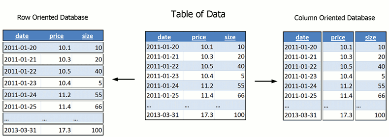
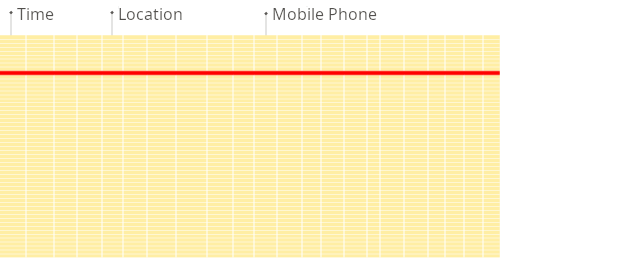
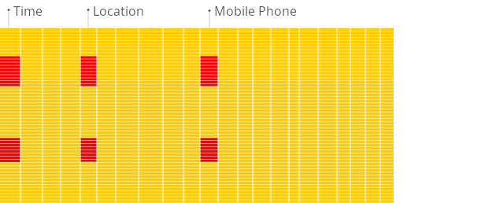

# ClickHouse

ClickHouse is an open-source, column-oriented OLAP database management system designed for real-time analytical queries on large volumes of data.

The core storage engine is based on immutable data parts that are continuously merged in the background for efficiency and maintenance.


## OLTP vs OLAP Databases

OLTP (Online Transaction Processing) and OLAP (Online Analytical Processing) are two fundamentally different types of database workloads and database systems.

- **OLTP** systems are designed to run the business.
  - Thousands to millions of small transactions
  - INSERT, UPDATE, DELETE
  - Access a few rows at a time
  - Millisecond response times
  - Heavy concurrent usage
- **OLAP** systems are designed to analyze the business.
  - Large scans across millions or billions of rows
  - Aggregations and grouping
  - Mostly read-only
  - Seconds to sub-second responses for huge datasets

## Columnar Storage Fundamentals

### Row-Oriented vs Column-Oriented Storage

| id | user_id | amount | timestamp |
| --- | --- | --- | --- |
| 1 | 100 | 50.5 | 2026-01-01 10:20:30 |
| 2 | 101 | 20.0 | 2026-01-01 20:30:40 |

Traditional databases such as PostgreSQL, MySQL, etc store rows sequentially on disk:

```text
row1: [1, 100, 50.5, ...]
row2: [2, 101, 22.0, ...]
```

ClickHouse stores each column separately:

```text
id.bin
user_id.bin
amount.bin
timestamp.bin
```



### Sample

```sql
SELECT MobilePhoneModel, COUNT() AS c
FROM metrica.hits
WHERE
      RegionID = 229
  AND EventDate >= '2013-07-01'
  AND EventDate <= '2013-07-31'
  AND MobilePhone != 0
  AND MobilePhoneModel not in ['', 'iPad']
GROUP BY MobilePhoneModel
ORDER BY c DESC
LIMIT 8;
```





### Benefits of Columnar Storage

- **I/O efficiency:** Queries often read only a subset of columns (e.g., SELECT sum(price), avg(quantity)). Columnar storage reads only those columns from disk, dramatically reducing I/O.
- **Better compression:** Values in a column have the same data type and often exhibit low cardinality or similarity (e.g., timestamps incrementing, repeated strings). Column‑oriented compression algorithms (LZ4, ZSTD, Delta, DoubleDelta, Gorilla, etc.) achieve high compression ratios.
- **Vectorized query processing:** Data from a column is read in blocks, and operations are applied to entire blocks using CPU vector instructions (SIMD), accelerating aggregate functions and filters.
- **Physical layout:** Each column’s data is stored in separate files on disk. Data is split into granularities (default 8192 rows per granule), forming the unit for compression and indexing.
- **CPU Cache Efficiency:** Homogeneous data improves cache locality and SIMD performance. Typical compression ratios are often 5× to 10×, and can be much higher for low-cardinality or highly repetitive columns

### What about wide-column databases like Cassandra and HBase?

Wide-column databases are not the same as column-oriented databases. Cassandra, HBase, and Bigtable store rows, but each row's columns can vary. They are sparse row stores optimised for high-write-throughput key-value access. They do not deliver the OLAP scan performance of a true columnar engine like ClickHouse or Snowflake. The naming overlap is the most common reader confusion in this category.

## Data Pipeline Relationship

```text
Applications
     ↓
OLTP Database
     ↓
ETL / CDC / Streaming
     ↓
Data Warehouse / OLAP Database
     ↓
BI Dashboards & Analytics
```

## References

- <https://clickhouse.com/docs>
- <https://clickhouse.com/resources/engineering/row-vs-column-database>
