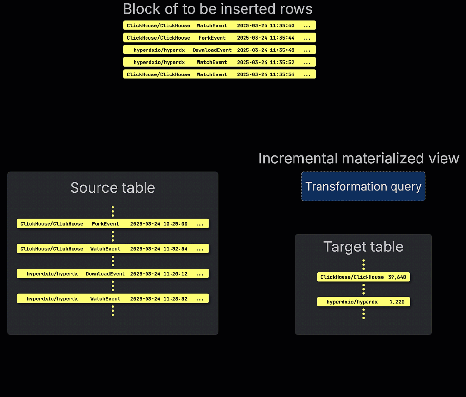
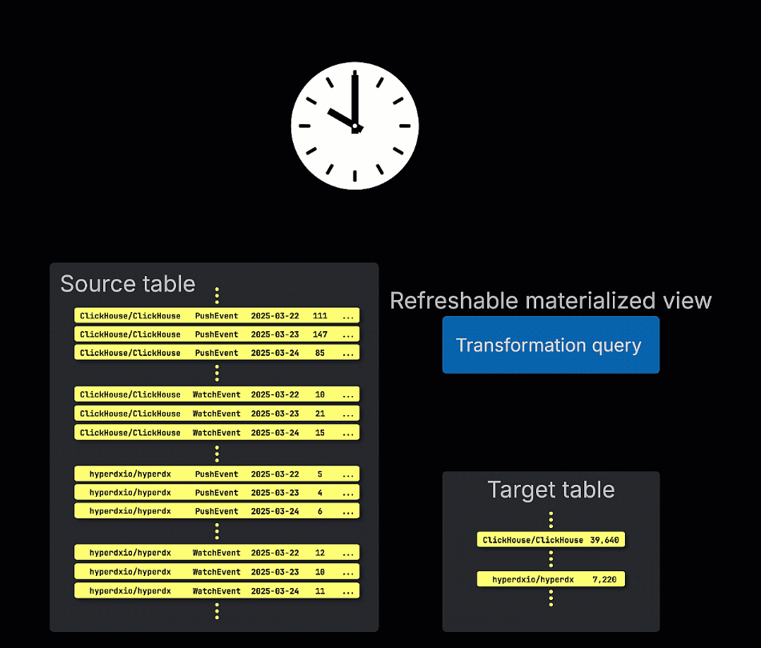

# ClickHouse SQL Statements

## Database

```sql
-- prints a list of all databases
SHOW DATABASES;

-- Creates a new database
CREATE DATABASE db1;

-- Lets you set the current database for the session.
USE db1;

-- Deletes all tables inside the db database, then deletes the db database itself.
DROP DATABASE db1;
```

<https://clickhouse.com/docs/sql-reference/statements/create/database>

## Table

```sql
-- List of tables
SHOW TABLES;

-- define a new table
CREATE TABLE my_first_table
(
    user_id UInt32,
    message String,
    timestamp DateTime,
    metric Float32
)
ENGINE = MergeTree;

-- These statements return a single column of type String, containing the CREATE query used for creating the table
SHOW CREATE TABLE my_first_table;

-- Descrice table
DESCRIBE TABLE my_first_table;

-- displays a list of columns
SHOW COLUMNS FROM my_first_table;

-- Insert data into a table
INSERT INTO my_first_table (user_id, message, timestamp, metric) VALUES
    (101, 'Hello, ClickHouse!',                                 now(),       -1.0   ),
    (102, 'Insert a lot of rows per batch',                     yesterday(), 1.41421),
    (102, 'Sort your data based on your commonly-used queries', today(),     2.718  ),
    (101, 'Granules are the smallest chunks of data read',      now() + 5,   3.14159);

-- Fetch data
SELECT * FROM my_first_table ORDER BY timestamp;

-- Dump query plan steps
EXPLAIN SELECT * FROM my_first_table ORDER BY timestamp;

-- Deletes all rows from the `my_first_table` table where the `message` column contains the text `Hello`
DELETE FROM my_first_table WHERE message LIKE '%Hello%';

-- force the use of Wide format for all data parts
ALTER TABLE my_first_table MODIFY SETTING min_bytes_for_wide_part = 1, min_rows_for_wide_part = 1;

-- Deletes one or more tables.
DROP TABLE my_first_table;
```

## View

```sql
-- Creates a new view.
CREATE VIEW daily_report AS
    SELECT toDate(timestamp) AS date, COUNT(*) AS total FROM my_first_table GROUP BY 1 ORDER BY 1 DESC LIMIT 10;

-- Fetch data from a view
SELECT * FROM daily_report;

-- Remove a view
DROP VIEW daily_report;
```

## Materialized View

It designed to accelerate queries by pre-computing and storing results

### Incremental materialized views

As new data is inserted into the source table, ClickHouse automatically applies the materialized view's query to the new data block and writes the results to a separate target table.



```sql
-- 1. Create a target table that will store the aggregated results
CREATE TABLE user_message_stats
(
    user_id UInt32,
    message_count UInt64,
    avg_metric Float32,
    last_message_time DateTime
)
ENGINE = SummingMergeTree()
ORDER BY user_id;

-- 2. Create the Materialized View that populates the target table
CREATE MATERIALIZED VIEW user_message_stats_mv TO user_message_stats AS
SELECT
    user_id,
    count(*) AS message_count,
    avg(metric) AS avg_metric,
    max(timestamp) AS last_message_time
FROM my_first_table
GROUP BY user_id;

-- Step 3: Manually backfill existing rows
INSERT INTO user_message_stats
SELECT
    user_id,
    count(*) AS message_count,
    avg(metric) AS avg_metric,
    max(timestamp) AS last_message_time
FROM my_first_table
GROUP BY user_id;

-- Insert sample record
INSERT INTO my_first_table (user_id, message, timestamp, metric) VALUES (101, 'Hello, Amir!', now(), -1.0);

-- Fetch result
SELECT * FROM user_message_stats;
SELECT * FROM user_message_stats FINAL;

-- Remove materialized view
DROP VIEW user_message_stats_mv;
```

### Refreshable materialized views

They by contrast, are updated on a schedule. These views periodically re-execute their full query and overwrite the result in the target table. This is similar to materialized views in traditional OLTP databases like Postgres.

- Replace
- Append



```sql
CREATE TABLE products (
    product_id UInt32,
    product_name String,
    category String
) ENGINE = MergeTree()
ORDER BY (product_id);

CREATE TABLE sales (
    sale_id UInt64,
    sale_time DateTime,
    product_id UInt32,
    amount UInt64
) ENGINE = MergeTree()
ORDER BY (sale_time);

CREATE MATERIALIZED VIEW top_products_report REFRESH EVERY 10 SECOND AS
SELECT
    p.category,
    count(*) AS total_sales,
    sum(s.amount) AS total_revenue
FROM sales s
JOIN products p ON s.product_id = p.product_id
GROUP BY p.category
ORDER BY total_sales DESC
LIMIT 10;

INSERT INTO products VALUES (101, 'Mobile', 'Phone');

INSERT INTO sales VALUES (201, now(), 101, 10);

SELECT * FROM top_products_report;

SYSTEM REFRESH VIEW top_products_report;

----------

CREATE MATERIALIZED VIEW top_hourly_products_report REFRESH EVERY 1 HOUR APPEND AS
SELECT
    toStartOfHour(now()) AS report_hour,
    p.category,
    count(*) AS total_sales,
    sum(s.amount) AS total_revenue
FROM sales s
JOIN products p ON s.product_id = p.product_id
WHERE s.sale_time >= toStartOfHour(now() - INTERVAL 1 DAY)
GROUP BY p.category
ORDER BY total_sales DESC
LIMIT 10;
```

## References

- <https://clickhouse.com/docs/tutorial>
- <https://clickhouse.com/docs/sql-reference/statements>
- <https://clickhouse.com/docs/sql-reference/statements/create/table>
- <https://clickhouse.com/docs/sql-reference/statements/explain>
- <https://clickhouse.com/docs/guides/developer/cascading-materialized-views>
- <https://clickhouse.com/docs/best-practices/use-materialized-views>
