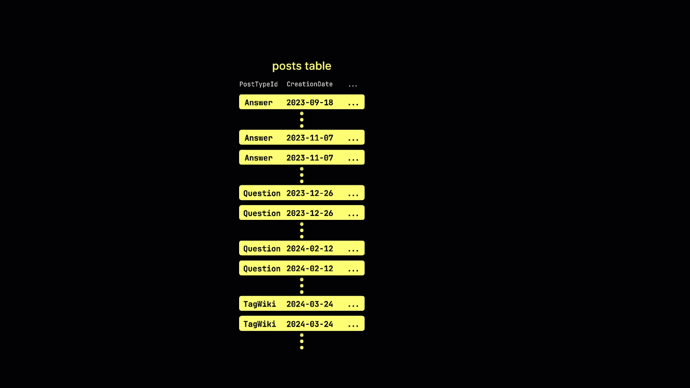
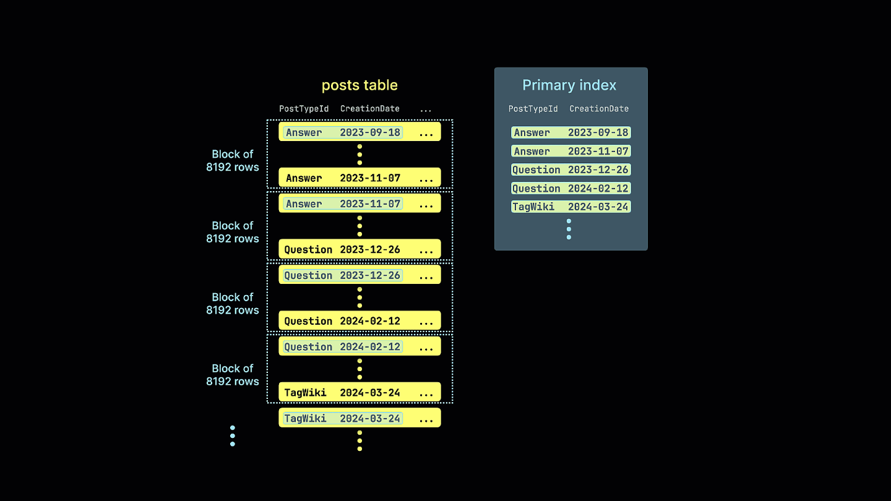

# Data Partitioning & Sorting Keys

## Partitioning (PARTITION BY)

- Partitions physically separate data by a key expression (e.g., toYYYYMM(date_column)).
- Each partition is stored as an independent set of data parts. Operations (e.g., ALTER TABLE ... DROP PARTITION) can affect whole partitions instantly.
- Partitions should be chosen to balance granularity (too few partitions hurts pruning; too many leads to many small files). Typical use: monthly or daily partitions for time‑series data.

```sql
PARTITION BY toYYYYMM(ts)
```

Recommended:

- Monthly partitions for time-series data
- Avoid high-cardinality partition keys

Time‑Based Functions (Most Popular): toYYYYMM(date), toYYYYMMDD(date), toYear(date), toQuarter(date), toStartOfMonth(date), toMonday(date), toStartOfDay(date), toHour(date)

```sql
CREATE TABLE events (
    event_time DateTime,
    user_id UInt64,
    event_type String
) ENGINE = MergeTree()
PARTITION BY toYYYYMM(event_time)
ORDER BY (event_time, user_id);

INSERT INTO events VALUES
    ('2025-01-15 10:00:00', 101, 'click'),
    ('2025-01-20 12:30:00', 102, 'view'),
    ('2025-02-01 08:15:00', 103, 'purchase'),
    ('2025-02-10 14:45:00', 104, 'click');

SELECT partition, name, rows
FROM system.parts
WHERE table = 'events' AND active = 1;

ALTER TABLE events DROP PARTITION '202501';

SELECT * FROM events;
```

## Sorting Key (ORDER BY)

- Determines the physical order of rows within each part.
- It is not unique unless you add a UNIQUE constraint (not enforced by default).
- The primary key (PRIMARY KEY) is a subset of the sorting key. If omitted, the primary key equals the sorting key.
- The primary key creates a sparse index over granules, allowing fast skipping of irrelevant granules during point and range lookups.

```sql
ORDER BY (symbol, ts)
```

Benefits:

- Sparse primary index
- Range scan efficiency
- Better compression

```sql
CREATE TABLE events (
    event_time DateTime,
    user_id UInt64,
    event_type String
) ENGINE = MergeTree
PARTITION BY toYYYYMM(event_time)
ORDER BY (event_time, user_id);
```

## PRIMARY KEY

Usually defaults to the sorting key.

```sql
PRIMARY KEY (symbol, ts)
```

### Sparse Primary Index

Instead of indexing every row, ClickHouse stores index entries per granule (typically every 8,192 rows). This keeps indexes very small and memory efficient.

```sql
CREATE TABLE events (
    event_date Date,
    user_id UInt64,
    event_type String
) ENGINE = MergeTree
PARTITION BY toYYYYMM(event_date)
ORDER BY (event_date, user_id)
PRIMARY KEY event_date;
```





## References

- <https://clickhouse.com/docs/engines/table-engines/mergetree-family/custom-partitioning-key>
- <https://clickhouse.com/docs/best-practices/choosing-a-primary-key>
