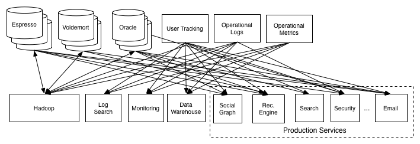
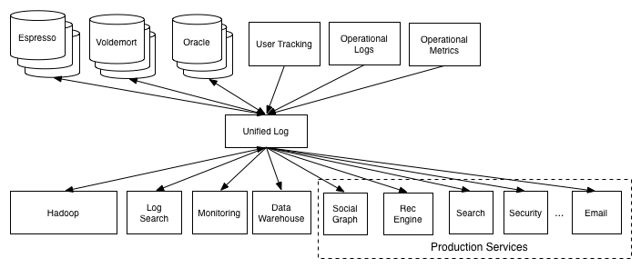

# Apache Kafka

Apache Kafka is a distributed event streaming platform designed for high-throughput, fault-tolerant, real-time data pipelines and streaming applications. It combines the durability of a log with the performance of a messaging system.

- Distributed: Runs as a cluster of machines. Scalable and reliable.
- Fault-Tolerant: No single point of failure. Data is replicated.
- Publish-Subscribe: Producers send messages, Consumers read them. Decoupled.
- Real-Time: Data is available to consumers immediately.
- Integration Costs: One system of record for events.
- Rich ecosystem tools: A vast ecosystem of connectors and stream processing libraries.

## The Problems: The Data Integration Spaghetti

- Tight Coupling: Systems are dependent on each other.
- Data Silos: Data is trapped in individual applications.
- Not Real-Time: Data transfer is often slow and batched.
- Fragile: If one system goes down, the whole chain can break.

- Decoupling & Resilience: Producers and consumers are independent.
- Scalability & Performance: Massive throughput with horizontal scaling
- Durability & Reliability: Data is Persisted on Disk.
- A Single Source of Truth: All data flows through one platform.
- Real-Time Capabilities: Events are available to consumers the moment they are published.

## Use Cases

- Use Case 1: Real-Time Stream Processing (Enables real-time decision making)
  - Example: Fraud detection, real-time recommendations.
- Use Case 2: Website Activity Tracking (Log and metric aggregation)
  - Example: Tracking page views, clicks, searches for analytics.
- Use Case 3: Microservices Communication (Connects data across teams and systems)
  - Example: Decoupling services in a modern cloud architecture.
- Use Case 4: Data Integration (ETL replacement)
  - Example: Ingesting data from various sources into a data lake or warehouse.

## Kafka Ecosystem

- Apache Kafka: Distributed event streaming platform
- Schema Registry: data format consistency
- Kafka Connect: integrates with databases, SaaS, cloud storage
- ksqlDB: SQL-like real-time queries
- Confluent Rest Proxy: a RESTful interface
- Kafka Streams: lightweight stream processing
- Confluent Platform: enterprise features

## References

- <https://kafka.apache.org/documentation>
