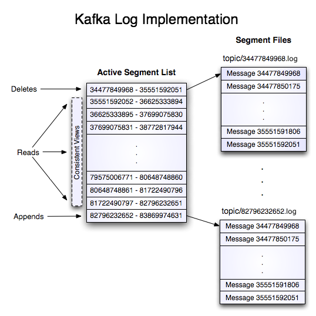
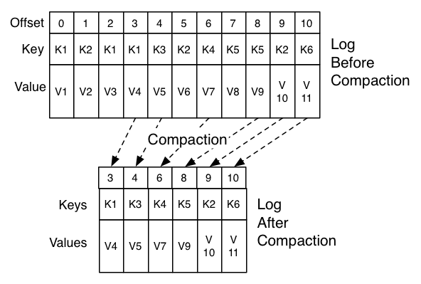
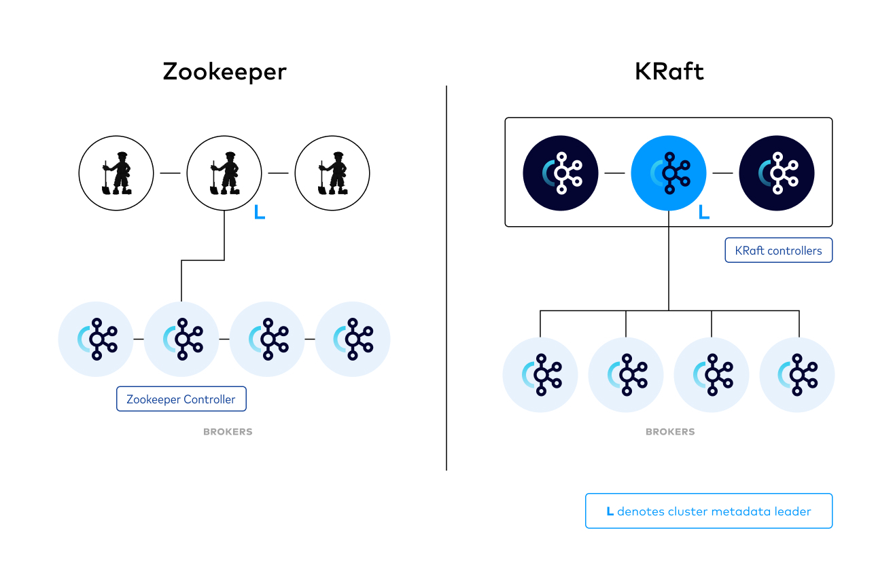

# Apache Kafka - Core Concepts

- Cluster
- Controller (KRaft)
- Brokers
- Topic
- Message
- Partitions
- Replication
- Offsets
- Consumer Group
- Producer
- Consumer

## Message (Record)

- Value
- Key
- Headers
- Topic
- Partition
- Offset
- Timestamp

## Topics, Partitions, Offsets

```text
Topic "orders"
├── Partition 0: [0, 1, 2, 3, ...]
├── Partition 1: [0, 1, 2, 3, ...]
└── Partition 2: [0, 1, 2, 3, ...]
```

## Replication

- Leader: handles all reads/writes
- Followers: replicate data
- ISR (In-Sync Replica): Set of followers that are fully caught up with the leader.

Replication factor (e.g., 3) ensures fault tolerance.

## Segment



## Cleanup Policy

- cleanup.policy=delete
- cleanup.policy=compact
- cleanup.policy=compact,delete

### Retention

Kafka retains records for a configurable time (default 7 days) or until a size limit is reached. Records are not deleted after consumption – retention is time/size‑based, not consumer‑based.

- retention.ms=604800000 (7 days)
- retention.bytes=1073741824

### Log Compaction

- min.cleanable.dirty.ratio
- min.compaction.lag.ms
- max.compaction.lag.ms
- delete.retention.ms



## Compression

Compresses a whole batch before sending. Options: gzip, snappy, lz4, zstd. Reduces network and storage I/O; more effective with batching.

- compression.type [uncompressed, zstd, lz4, snappy, gzip, producer]

## KRaft vs ZooKeeper

In KRaft mode, Kafka eliminates its dependency on ZooKeeper, and the control plane functionality is fully integrated into Kafka itself. The process roles are clearly separated: brokers handle data-related requests, while the controllers (a.k.a., quorum controller) manages metadata-related requests. The controllers use the Raft protocol for internal communication, which operates differently from the ZooKeeper model.

<https://raft.github.io>



## References

- <https://kafka.apache.org/documentation>
