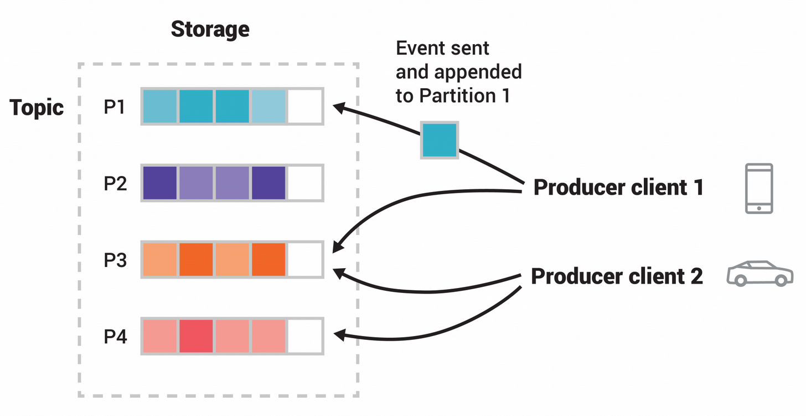

# Apache Kafka - Producer

Publishes records to a topic. Decides which partition to send to (explicitly or via a key).

## Keys & Partitioning

- Record consists of an optional key and a value.
- Partitioning logic:
  - If a partition is specified explicitly → use that partition.
  - Else if a key is provided → hash(key) % (number of partitions) → deterministic partition.
  - Else → round‑robin (sticky partitioning in newer versions for batching efficiency).
- Keys ensure that all messages with the same key go to the same partition, preserving order per key.

## Acknowledgments

acks configuration:

- acks=0 - no acknowledgment; highest throughput, possible data loss.
- acks=1 - leader writes to its local log and responds; still at risk if leader fails before followers replicate.
- acks=all (or -1) - leader waits for all ISR replicas to acknowledge; strongest durability.

## Retries

Automatic resend on transient failures (e.g., leader election). Combined with delivery.timeout.ms

## Idempotent Producer

- Enabled with enable.idempotence=true (requires acks=all and retries > 0).
- Prevents duplicate records caused by producer retries. Kafka assigns a producer ID and uses sequence numbers per partition to deduplicate.
- Exactly‑once semantics at the producer side (no duplicates, no data loss within a producer session).

## Batching

Producers accumulate records in memory (by partition) to send in larger requests. Controlled by:

- batch.size (max bytes per batch)
- linger.ms (time to wait for more records before sending)

## References

- <https://kafka.apache.org/42/configuration/producer-configs/>
