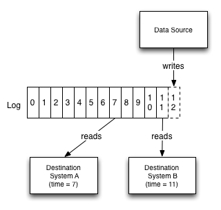

# Apache Kafka - Consumer

Reads records from a topic. Pulls data (not push). Each consumer tracks its position via offsets.

## Consumer Groups

- A consumer group is a set of consumers that cooperate to consume a topic.
- Each partition is assigned to exactly one consumer in the group → parallel processing.
- If there are more consumers than partitions, idle consumers sit unused.
- Consumer groups maintain their committed offsets for each partition under a group coordinator.

## Offset Commits

- Consumers can manually or automatically commit the offset they last successfully processed.
- Commit tells Kafka: “I’ve processed all records up to offset X”. After that, the consumer group can resume from that point.
- Commit methods:
  - Auto‑commit (enable.auto.commit=true, auto.commit.interval.ms) – at‑most‑once semantics by default.
  - Manual sync/async commit – for finer control and exactly‑once or at‑least‑once.
- Committed offsets are stored in an internal Kafka topic (__consumer_offsets).

## Rebalancing

- Rebalance occurs when a consumer joins or leaves a group, or when partitions change.
- During rebalancing, all consumers in the group stop consuming and partitions are reassigned.
- Rebalance protocols:
  - Eager rebalancing (older): all consumers revoke all partitions, then re‑assign.
  - Cooperative rebalancing (incremental): only a subset of partitions is revoked, reducing “stop‑the‑world” impact.
- Consumers should implement ConsumerRebalanceListener to clean up state (e.g., commit offsets before revocation).

## Delivery Semantics

| Semantics | Guarantee | Typical Approach |
| --- | --- | --- |
| At most once | Record may be lost but never processed twice | Auto‑commit before processing |
| At least once| Record is never lost, may be processed multiple times | Commit after processing; duplicates possible on failure/rebalance |
| Exactly once | Each record is processed exactly once | Kafka Transactions (producer + consumer) + idempotent producer + offset committed as part of the transaction |

Exactly‑once in Kafka Streams or with transactional APIs: use read_committed isolation level and atomic writes of processing result + offset commit.

## References

- <https://kafka.apache.org/42/configuration/consumer-configs/>
- <https://ibm-cloud-architecture.github.io/refarch-eda/technology/kafka-consumers/>
