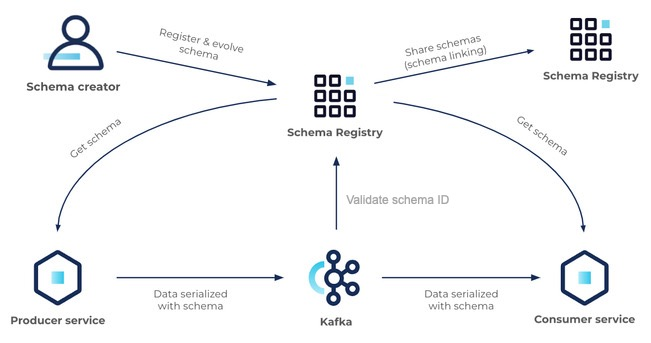
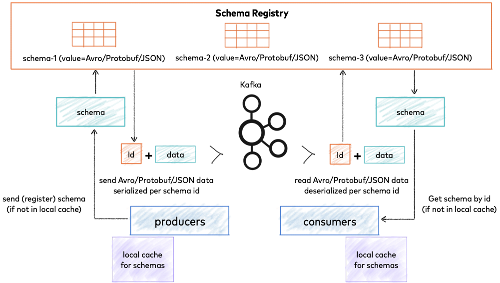

# Schema Registry

A Schema Registry is a central service that manages schemas for data streams (e.g., Apache Kafka). Instead of embedding the full schema in each message, producers and consumers register schemas once, then exchange only a schema ID. This keeps messages small and ensures compatibility between writers and readers.

A REST service for validating, storing, and retrieving Avro, JSON Schema, and Protobuf schemas

## Schema Management

- Central storage – All schemas are stored in a repository (e.g., subject per Kafka topic).
- Subject naming – Usually topic-key and topic-value to separate key and value schemas.
- Reference lookup – Producers and consumers fetch the latest schema for a subject to serialize/deserialize.
- Governance – Access controls, audit logs, and schema validation at write time.

## Versioning

- Immutable versions – Every registered schema change creates a new, immutable version (integer, starting from 1).
- Version history – Old versions are preserved for backward compatibility.
- Compatibility checks – A new version is accepted only if it passes the configured compatibility rule against previous versions.
- Backward references – Deserializers can decode data produced with older schema versions using the stored history.

## Compatibility concepts

The Schema Registry server can enforce certain compatibility rules when new schemas are registered in a subject. These are the compatibility types:

- BACKWARD: (default) consumers using the new schema can read data written by producers using the latest registered schema
- BACKWARD_TRANSITIVE: consumers using the new schema can read data written by producers using all previously registered schemas
- FORWARD: consumers using the latest registered schema can read data written by producers using the new schema
- FORWARD_TRANSITIVE: consumers using all previously registered schemas can read data written by producers using the new schema
- FULL: the new schema is forward and backward compatible with the latest registered schema
- FULL_TRANSITIVE: the new schema is forward and backward compatible with all previously registered schemas
- NONE: schema compatibility checks are disabled

## Serialization Basics in Schema Registry

- Producer
  - Serializes the data using the latest version of the schema
  - Prepends the schema ID to the binary data (typically a magic byte + a 4‑byte ID)
  - Sends the complete binary payload to the destination (e.g., Kafka)
- Registry
  - Stores and manages all schemas
  - When a producer registers a new schema or a consumer fetches an existing one, the registry returns a unique schema ID
- Consumer
  - Receives the binary message and extracts the schema ID from the beginning (magic byte + 4 bytes)
  - Fetches the corresponding schema from the registry using that ID
  - Uses the schema to deserialize the binary data back into its original format

This decouples the message format (binary) from the schema definition.

- Schemas are stored centrally, not embedded in every message
- Producers and consumers don't need to know each other's schema versions in advance
- Changing a schema version doesn't require updating every producer/consumer simultaneously
- Consumers can correctly interpret any message as long as they can reach the registry

## Avro vs JSON Schema – Comparison

| Aspect | Avro | JSON Schema |
| --- | --- | --- |
| Serialization format | Binary, compact, no field names in payload. | Usually JSON text (large) but binary encodings exist (e.g., CBOR, MessagePack). |
| Schema storage | Schema must be known to both sides (perfect fit for registry). | Schema can be embedded or referenced; registry avoids embedding. |
| Performance | Very fast (binary, no name parsing). | Slower if using JSON text; binary variants improve but still more overhead. |
| Data types | Primitive + records, enums, arrays, maps, unions, fixed. | Richer (integer, number, string, boolean, object, array, null, plus formats like date-time). |
| Evolution rules | Strict, well-defined, predictable. | More flexible but compatibility checking is complex (registry may impose stricter rules). |
| Ecosystem | Dominant in Kafka, Hadoop, Spark. | Widely used in REST APIs, databases, and validation libraries. |
| Human | readability. Not readable without schema (binary). | Readable when using JSON encoding. |

### Summary

- Avro is better for high performance and big data environments (like Kafka), but the output is not human-readable.
- JSON Schema is widely used for web APIs and cases where JSON readability matters, but it's larger and slower than Avro.

## References

- <https://docs.confluent.io/platform/current/schema-registry/index.html>
- <https://docs.confluent.io/platform/current/schema-registry/schema_registry_onprem_tutorial.html>
- <https://docs.confluent.io/platform/current/schema-registry/fundamentals/schema-evolution.html>