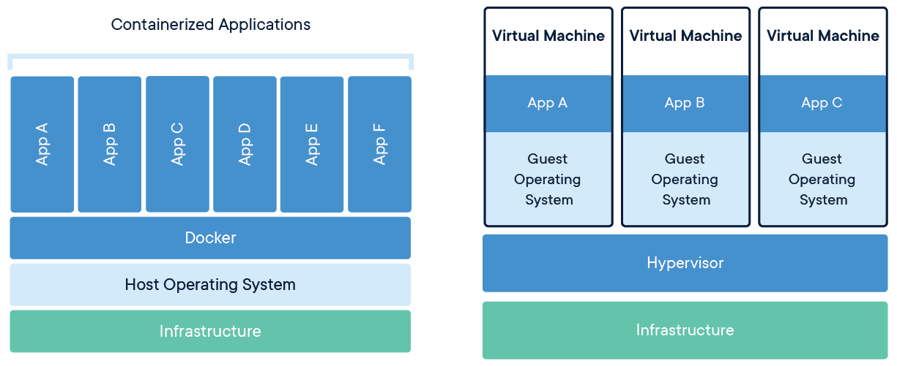

# Docker

Docker provides the ability to package and run an application in a loosely isolated environment called a container. The isolation and security let you run many containers simultaneously on a given host. Containers are lightweight and contain everything needed to run the application, so you don't need to rely on what's installed on the host. You can share containers while you work, and be sure that everyone you share with gets the same container that works in the same way.

- What is Docker?
- What is a Container?
- What is a Virtual Machine (VM)?
- What is a Server (Bare Metal)?
- What is a Personal Computer (PC)?

## Docker Engine security (isolation)

- Kernel namespaces
- Control groups

## References

- <https://docs.docker.com/engine/security/>
